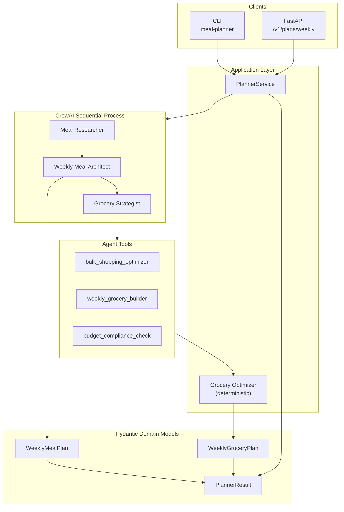
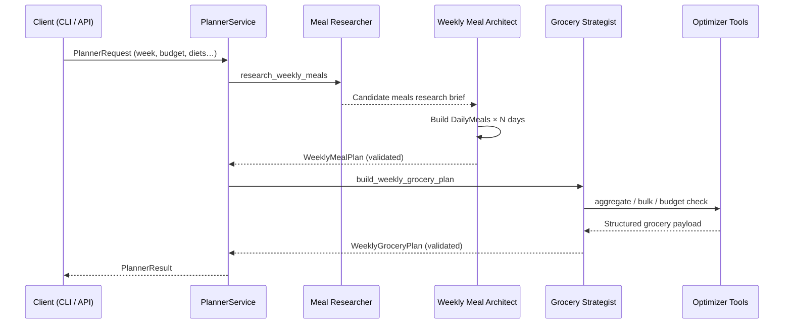
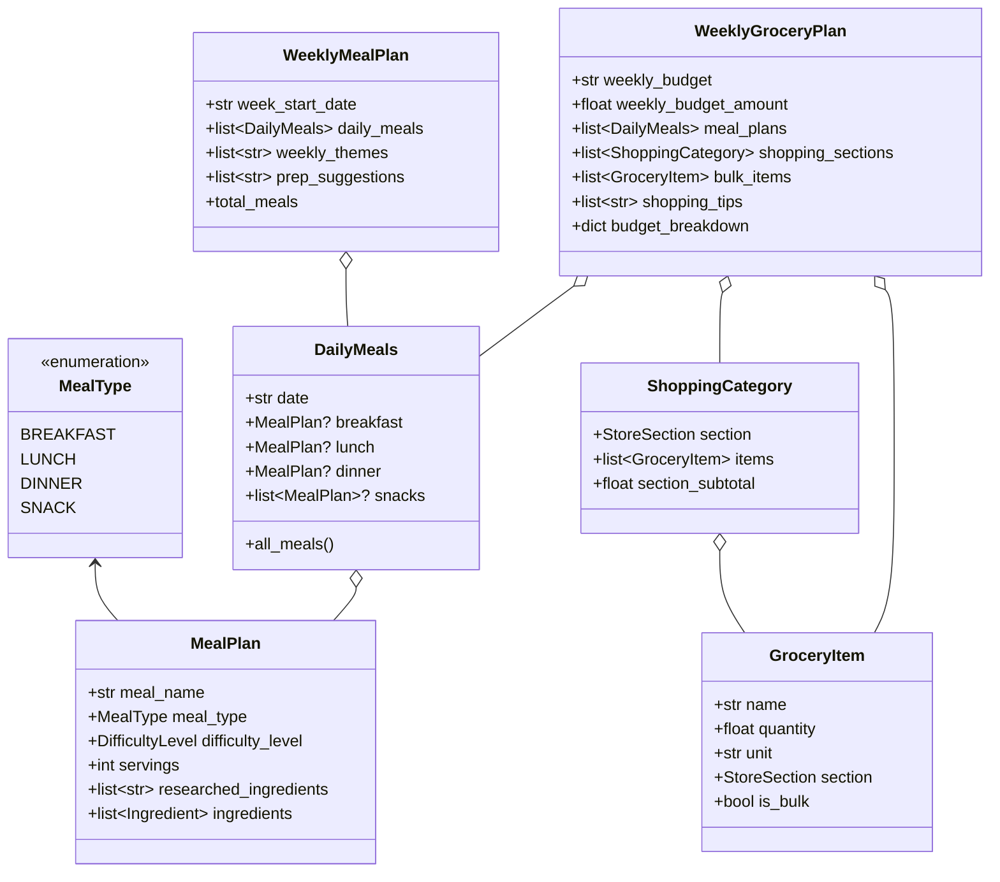
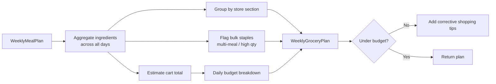

# Structured Meal & Grocery Planner with CrewAI

Production-ready multi-agent system that designs a **full week of meals** (breakfast, lunch, dinner, snacks) and turns them into a **budget-aware, bulk-optimized grocery plan** — with strict Pydantic schemas end to end.

This project extends single-meal planning into **weekly structured planning** (Exercise 2): `MealType`, `DailyMeals`, `WeeklyMealPlan`, and `WeeklyGroceryPlan`.

---

## Why this is not a toy demo

| Production concern | How this repo addresses it |
| --- | --- |
| Structured outputs | Versioned Pydantic v2 models with validators (ISO dates, week span, unique days) |
| Agent contracts | YAML-defined agents/tasks + `output_pydantic` on CrewAI tasks |
| Deterministic optimization | Bulk/budget tools are pure Python — testable without an LLM |
| Operability | FastAPI + CLI + Docker + health checks + offline mode for CI |
| Config & secrets | `pydantic-settings`, `.env.example`, no secrets in code |
| Quality gates | Pytest suite covering models, optimizer, API smoke tests |

---

## Architecture overview



### Agent pipeline



### Domain model map (Exercise 2)



### Data flow for bulk & budget optimization



---

## Repository layout

```text
Structured-Meal-Grocery-Planner-with-CrewAI/
├── config/
│   ├── agents.yaml          # Agent roles, goals, backstories
│   └── tasks.yaml           # Task prompts + expected outputs
├── src/meal_planner/
│   ├── api/                 # FastAPI app
│   ├── config/              # pydantic-settings
│   ├── crew/                # CrewAI crew assembly
│   ├── models/              # Meal / grocery / weekly Pydantic models
│   ├── services/            # PlannerService + deterministic optimizer
│   ├── tools/               # CrewAI tools (bulk, grocery, budget)
│   ├── cli.py               # Typer CLI
│   └── main.py              # uvicorn entry
├── tests/                   # Model, service, API tests
├── examples/                # Sample WeeklyMealPlan JSON
├── Dockerfile
├── docker-compose.yml
├── pyproject.toml
└── .env.example
```

---

## Exercise 2 — Weekly Pydantic models

Core types live in `src/meal_planner/models/`:

- **`MealType`** — `breakfast | lunch | dinner | snack`
- **`DailyMeals`** — optional breakfast/lunch/dinner + snack list for one `YYYY-MM-DD`
- **`WeeklyMealPlan`** — week start, daily meals, themes, prep suggestions (validates week span & unique dates)
- **`WeeklyGroceryPlan`** — weekly budget, sectioned shopping list, bulk items, tips, daily budget breakdown

Minimal example (same shape as the course exercise):

```python
from meal_planner.models import DailyMeals, MealPlan, WeeklyMealPlan

sample_weekly_plan = WeeklyMealPlan(
    week_start_date="2026-07-29",
    daily_meals=[
        DailyMeals(
            date="2026-07-29",
            breakfast=MealPlan(
                meal_name="Oatmeal",
                difficulty_level="Easy",
                servings=2,
                researched_ingredients=["oats", "milk", "berries"],
            ),
            lunch=MealPlan(
                meal_name="Salad",
                difficulty_level="Easy",
                servings=2,
                researched_ingredients=["lettuce", "tomatoes", "dressing"],
            ),
            dinner=MealPlan(
                meal_name="Pasta",
                difficulty_level="Medium",
                servings=2,
                researched_ingredients=["pasta", "sauce", "cheese"],
            ),
        )
    ],
    weekly_themes=["Italian Monday", "Taco Tuesday"],
    prep_suggestions=["Wash vegetables on Sunday", "Cook grains in bulk"],
)

print(sample_weekly_plan.model_dump_json(indent=2))
```

Validate from the CLI:

```bash
meal-planner validate-models
```

---

## Quick start

### 1. Install

```bash
python -m venv .venv
source .venv/bin/activate  # Windows: .venv\Scripts\activate
pip install -e ".[dev]"
cp .env.example .env
# set OPENAI_API_KEY in .env
```

### 2. Offline plan (no LLM — great for demos / CI)

```bash
meal-planner plan --week-start 2026-07-29 --budget 150 --offline
```

### 3. Full CrewAI plan

```bash
meal-planner plan \
  --week-start 2026-07-29 \
  --budget 150 \
  --household-size 2 \
  --diet vegetarian \
  --cuisine Italian \
  --output outputs/week.json
```

### 4. HTTP API

```bash
uvicorn meal_planner.api.app:app --reload
```

```bash
curl -s -X POST 'http://127.0.0.1:8000/v1/plans/weekly?use_llm=false' \
  -H 'Content-Type: application/json' \
  -d '{
    "week_start_date": "2026-07-29",
    "household_size": 2,
    "weekly_budget": 150,
    "dietary_constraints": ["vegetarian"],
    "cuisine_preferences": ["Italian", "Mexican"]
  }' | jq .
```

### 5. Docker

```bash
docker compose up --build
```

---

## Crew responsibilities

| Agent | Responsibility | Structured output |
| --- | --- | --- |
| **Meal Researcher** | Find practical meals for diets, budget, cuisines | Research brief |
| **Weekly Meal Architect** | Compose 7-day calendar + themes + prep | `WeeklyMealPlan` |
| **Grocery Strategist** | Consolidate cart, bulk buys, aisle sections, budget | `WeeklyGroceryPlan` |

Tools available to the grocery strategist:

- `bulk_shopping_optimizer` — staples reused across meals
- `weekly_grocery_builder` — sectioned cart + daily budget allocation
- `budget_compliance_check` — over/under budget corrective actions

---

## Configuration

| Variable | Default | Purpose |
| --- | --- | --- |
| `OPENAI_API_KEY` | — | LLM access |
| `OPENAI_MODEL_NAME` | `gpt-4o-mini` | Default chat model |
| `DEFAULT_WEEKLY_BUDGET` | `150` | Fallback budget |
| `ENABLE_BULK_OPTIMIZATION` | `true` | Bulk staple detection |
| `CREW_VERBOSE` | `true` | Agent step logging |
| `APP_ENV` | `development` | `development \| staging \| production` |

---

## Testing

```bash
pytest
pytest --cov=meal_planner --cov-report=term-missing
```

Coverage includes:

- Exercise 2 sample `WeeklyMealPlan`
- Full 7-day / multi-meal-type validation
- Grocery aggregation, bulk flags, budget breakdown
- Offline `PlannerService` end-to-end
- FastAPI `/health` and `/v1/plans/weekly?use_llm=false`

---

## Design principles

1. **Schema-first** — agents must satisfy Pydantic models; invalid plans fail fast.
2. **Hybrid intelligence** — LLMs propose meals; deterministic code owns aggregation, money math, and aisle grouping.
3. **Offline path** — every critical path has a non-LLM mode for local demos and CI.
4. **Thin agents, rich domain** — business rules live in `models/` + `services/`, not buried in prompts.
5. **Observable boundaries** — CLI table view, JSON export, API `provenance` metadata.

---

## License

MIT
